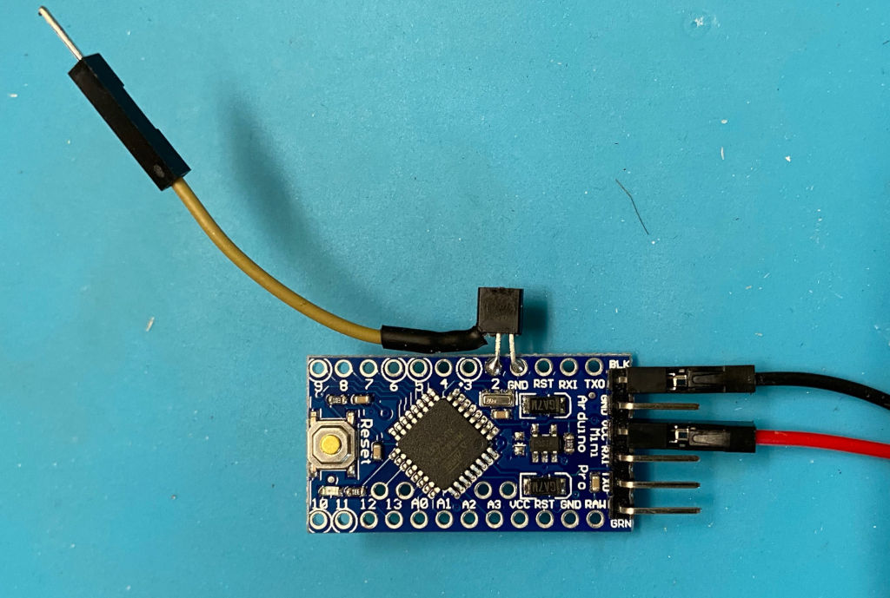

# LED-Lamp-Auto-PowerOff
Arduino based module to allow easy retrofit of existing battery powered Lamps with auto power off feature.

NOTE! This is meant to be used only with battery powered lamps or devices.


This module is meant to be connected after power switch (power switch can be on on positive or negative wire).Typically you would only need to cut the negative wire going to the light bulb/module (and connect the end going to the lamp to the MOSFET drain leg, and the end that goes to battery pack to Arduino GND pin). Then for power add new cable (after power switch) that goes to the arduino (Vcc).

### Notes
- Either 16Mhz or 8Mhz "Pro-Mini" works, but 8Mhz is recommended as it runs stable when batteries run low (even on 3xAA battery pack)
- If "lamp" current is high (>250mA or so), it may be good idea to substitute MOSFET with a higher current part and connect MOSFET source pin directly to battery negative (not to arduino GND).
- If battery pack voltage is >5V, connect voltage to RAW pin on Arduino (instead of VCC pin)
- Power switch can be on either positive or negative connection to battery
- Optional: Remove power LED from the "Pro-Mini" to minimize battery drain

## Parts
- Arduino "Pro-Mini" 8Mhz (3.3V)
- BS170 (N-channel MOSFET)
- some wire
- dupont connectors (optional)


You may want to use Dupont connectors, so Arduino can be easily removed for programming (if needed).


## Configuration
Open the included arduino sketch (LED-Lamp-Auto-Poweroff.ino) in Arduino IDE and edit the automatic timeout (power-off) to desired value:
```
#define TIMEOUT   60 // lamp timeout in minutes
```
